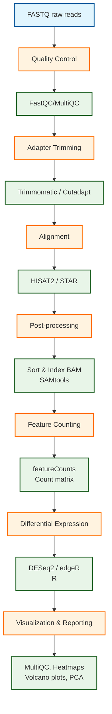

# RNA-seq Analysis Pipeline (Bash-Orchestrated HPC Version)

A comprehensive, modular RNA-seq analysis pipeline designed for High-Performance Computing (HPC) environments. This pipeline automates the RNA-seq workflow from raw FASTQ files to differential expression analysis and visualization, ensuring reproducibility and scalability for large transcriptomic datasets.

---

## 📋 Table of Contents
- [Project Objective](#project-objective)
- [Stakeholders](#stakeholders)
- [Pipeline Overview & Flow](#pipeline-overview--flow)
- [Features](#features)
- [Prerequisites](#prerequisites)
- [Installation](#installation)
- [Usage](#usage)
- [Pipeline Steps](#pipeline-steps)
- [Input/Output](#inputoutput)
- [Configuration](#configuration)
- [Project Structure](#project-structure)
- [Contributing](#contributing)
- [License](#license)
- [Citation](#citation)
- [Contact](#contact)

---

## 🎯 Project Objective

The goal of this pipeline is to provide a **reproducible, scalable, and modular workflow for RNA-seq analysis** in an HPC environment. It automates:

- Quality control of sequencing reads  
- Adapter trimming  
- Alignment to reference genomes  
- BAM post-processing (sorting, indexing)  
- Gene quantification (count matrices)  
- Differential expression analysis  
- Visualization and reporting  

---

## 👥 Stakeholders

- **Computational Biologists / Bioinformaticians:** Develop and run RNA-seq analyses  
- **Lab Scientists / Wet-Lab Teams:** Provide sequencing datasets and interpret results  
- **Data Scientists / Statisticians:** Perform downstream statistical analysis and visualization  
- **Project Managers / Collaborators:** Monitor pipeline progress and results  
- **IT / HPC Administrators:** Maintain HPC infrastructure, user access, and scheduling efficiency  

---

## 🔄 Pipeline Overview & Flow

This **Bash-orchestrated pipeline** is modular, HPC-ready, and reproducible. Each step is isolated in Conda environments, wrapped as HPC jobs, and orchestrated via a master runner script with automatic dependency checking and error handling.


---

## ✨ Features

- Modular and reproducible design  
- HPC optimized: parallelization, dependency handling, resource allocation  
- Isolated Conda environments per tool  
- Logging and checkpoint support  
- Resume failed runs without rerunning completed steps  
- Multi-sample parallelization  
- Configurable via YAML files  
- Optional aligner choice: HISAT2, STAR, or Salmon  
- Automated reporting (MultiQC + RMarkdown)  

---

## 📦 Prerequisites

**Hardware:**  
- HPC cluster with job scheduler (PBS, SLURM, or SGE)  
- Minimum 8GB RAM per sample (recommended 16GB+)  
- Storage: ≥10x raw data size for intermediate files  

**Software:**  
- Linux OS (CentOS 7+, Ubuntu 18.04+)  
- Bash (v4+), Git, wget/curl  
- Conda / Miniconda3  
- Job scheduler: PBS/Torque, SLURM, or SGE  
--- 

## 🔧 Installation

1. **Clone repository** 

    ```bash
git clone https://github.com/yourusername/rna-seq-pipeline-hpc.git
cd rna-seq-pipeline-hpc

2. **Setup project directories and environments**

bash scripts/bash/setup_directories.sh
bash scripts/bash/setup_environments.sh

3- **Download reference genomes and annotations**

bash scripts/bash/download_reference.sh --genome GRCh38 --output-dir /path/to/references

4. **Configure pipeline**
cp config/config.example.yaml config/config.yaml
vim config/config.yaml  # Set paths, parameters, cluster options

## 🚀 Usage
./run_pipeline.sh --config config/config.yaml --samples samplesheet.csv


---
## 📂 Project Structure

rna_seq_pipeline/
├── README.md
├── environment/          # Conda YAML files
├── scripts/
│   ├── bash/             # HPC wrapper scripts
│   ├── r/                # DESeq2 analysis scripts
│   └── python/           # QC / preprocessing
├── data/                 # Raw / small test datasets
├── results/              # BAMs, count matrices, figures
├── docs/                 # Metadata, reports
├── config/               # config.yaml, cluster.yaml
├── workflow/             # Optional workflow files
├── logs/                 # HPC job logs
└── run_pipeline.sh       # Master orchestrator

---

## 🤝 Contributing
Contributions are welcome! Please submit pull requests and open issues. Follow coding standards and document changes.

## 📄 License

MIT License
Contributions are welcome! Please submit pull requests and open issues. Follow coding standards and document changes.
